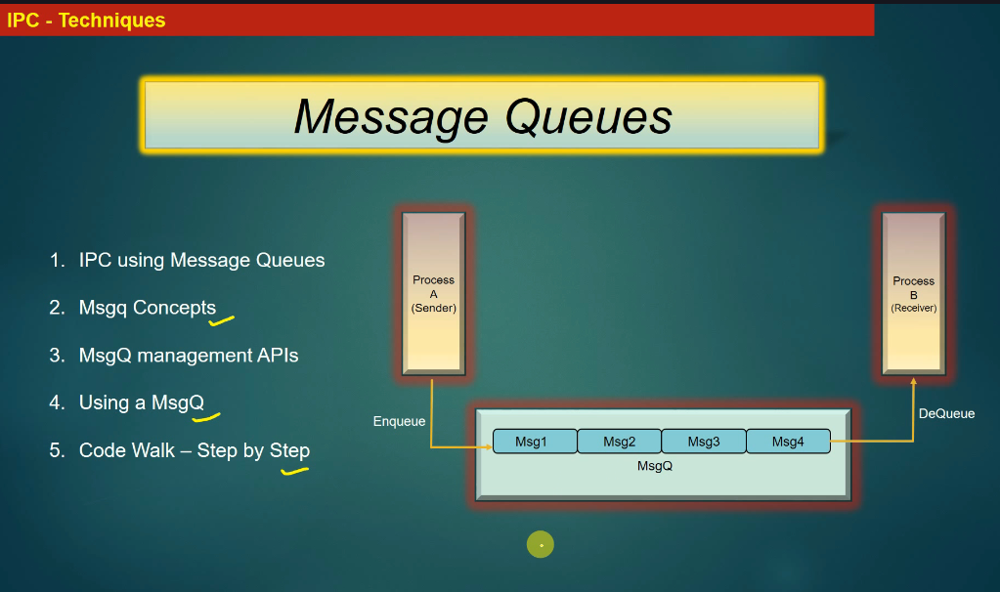
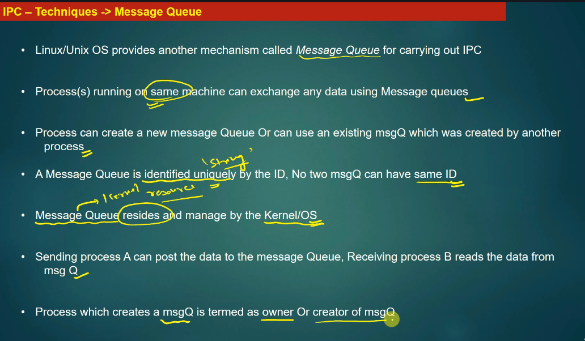
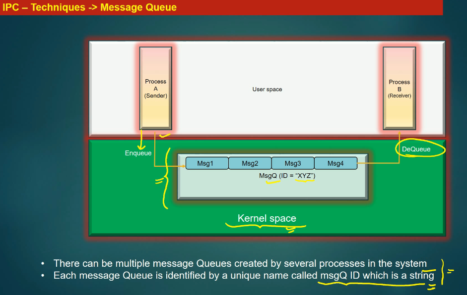
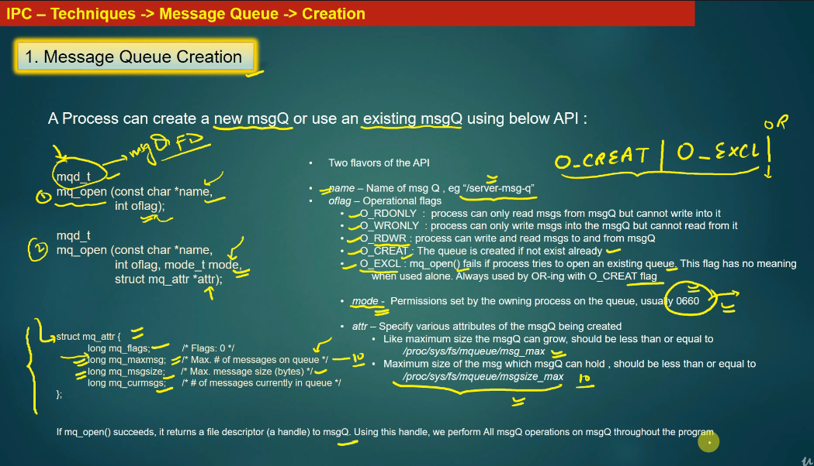
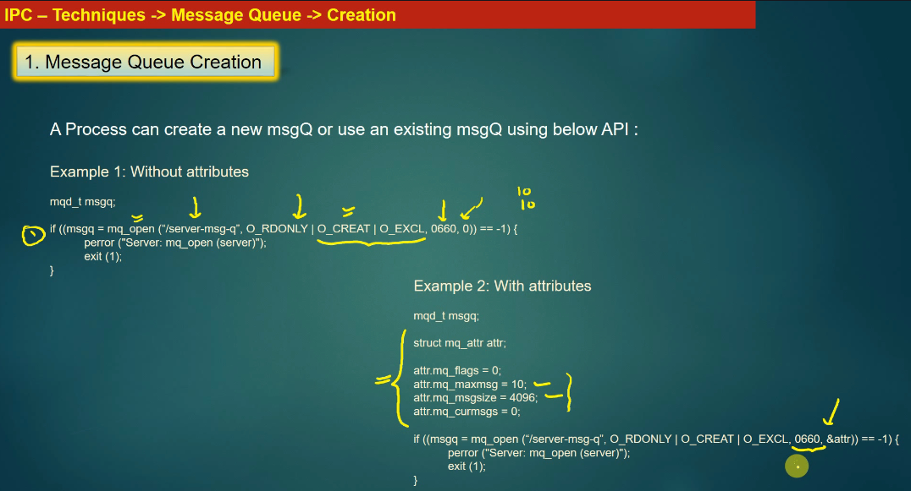
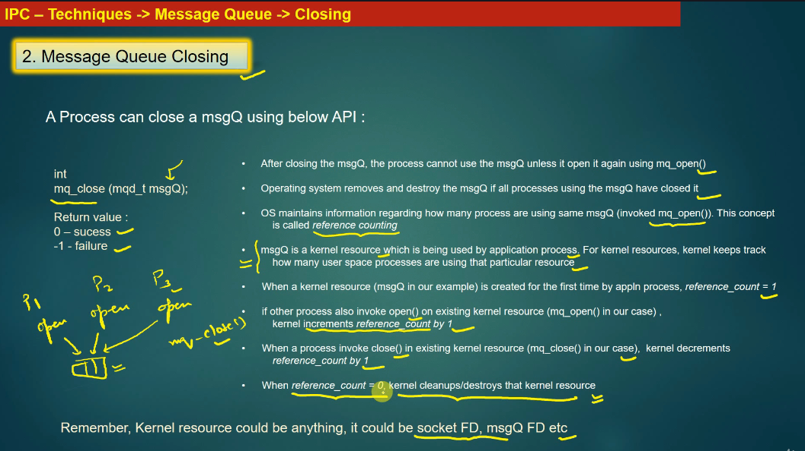
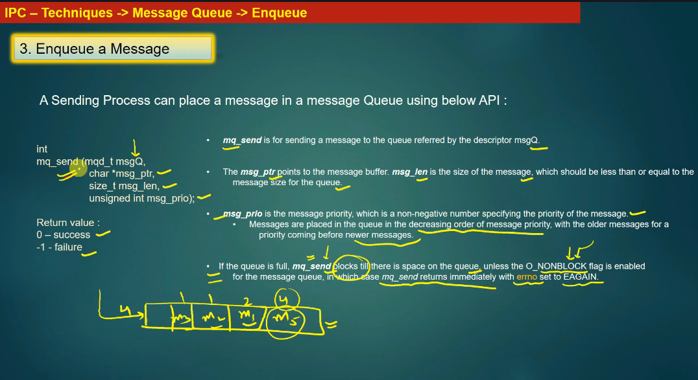
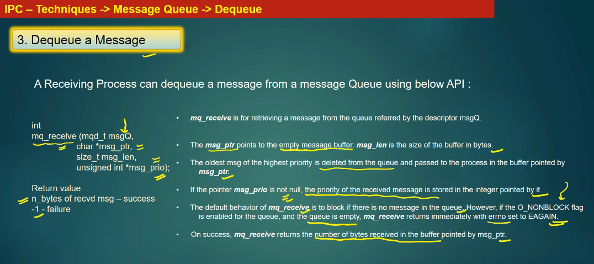
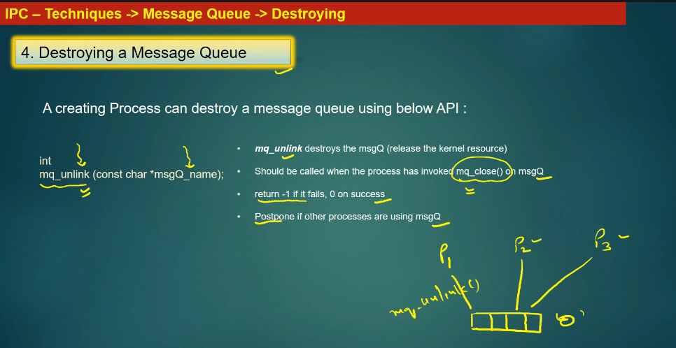
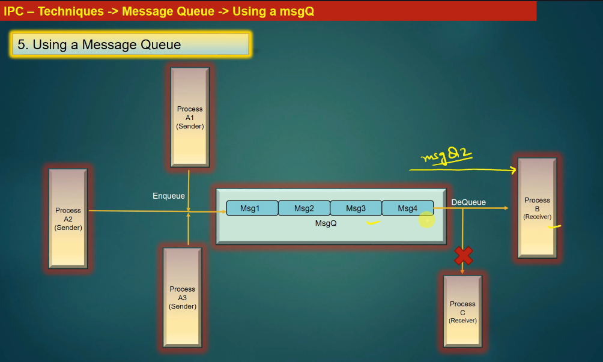

## How to run

Build once from the repo root:

```sh
make
```

Then run the binaries from `build/` (one receiver, one sender):

```sh
./build/IPC/msgQ/recvr /demoq
```

In another terminal:

```sh
./build/IPC/msgQ/sender /demoq
```

The queue name must start with `/` (POSIX MQ rule), e.g. `/demoq`.

## Pair (single sender/receiver)

Use the same queue name for the pair:

```sh
./build/IPC/msgQ/recvr /pair1
./build/IPC/msgQ/sender /pair1
```

Receiver blocks on `select()` and prints messages as they arrive.
------------------------------------




Message Queue is Kernel resource
Each Message Queue is identified by unique name
Receiver alway use existing Message Queue in Kernel
Sender maybe create new Message Queue























No — **`mq_close()` and `mq_unlink()` are *not* the same**, but they are **closely related**, very similar to `close()` vs `unlink()` for files.

Below is the **POSIX message queue mental model**, explained at **kernel / system level**.

---

## 1. What each function does

### `mq_close()`

```c
int mq_close(mqd_t mqdes);
```

**Purpose**

* Closes *your process’s handle* to a message queue
* Equivalent to `close(fd)`

**Effect**

* Decrements the **reference count** for that queue in the calling process
* Queue **still exists** if:

  * Other processes have it open, or
  * It has not been unlinked

**Scope**

* Per-process

---

### `mq_unlink()`

```c
int mq_unlink(const char *name);
```

**Purpose**

* Removes the **name** of the message queue from the system
* Equivalent to `unlink("/file")`

**Effect**

* Queue becomes **anonymous**
* No new opens allowed
* Actual kernel object is destroyed **only after all processes call `mq_close()`**

**Scope**

* System-wide

---

## 2. File-system analogy (best way to remember)

| Files      | Message Queues |
| ---------- | -------------- |
| `open()`   | `mq_open()`    |
| `close()`  | `mq_close()`   |
| `unlink()` | `mq_unlink()`  |

📌 **Key idea**

> `unlink()` removes the name, `close()` removes your reference.

Same rule applies to message queues.

---

## 3. Lifecycle example (realistic scenario)

### Process A

```c
mqd_t q = mq_open("/myq", O_CREAT | O_RDWR, 0644, NULL);
```

### Process B

```c
mqd_t q = mq_open("/myq", O_RDWR);
```

### Process A

```c
mq_unlink("/myq");   // name removed
```

**Result**

* Process B still uses the queue
* New `mq_open("/myq")` → ❌ fails (`ENOENT`)

### Process B

```c
mq_close(q);
```

➡️ **Now the kernel finally destroys the queue**

---

## 4. Common mistakes (very important)

### ❌ Mistake 1: Only calling `mq_close()`

```c
mq_close(q);
```

* Queue **still exists**
* Causes **resource leaks**
* Queue remains visible in:

```sh
/dev/mqueue/
```

---

### ❌ Mistake 2: Only calling `mq_unlink()`

```c
mq_unlink("/myq");
```

* Queue still consumes memory
* Kernel object lives until all handles are closed

---

### ✅ Correct cleanup pattern

```c
mq_close(q);
mq_unlink("/myq");
```

📌 **Order doesn’t matter**

* Kernel tracks both reference count and name

---

## 5. Kernel-level view (simplified)

```
/dev/mqueue/myq
        |
        v
 +------------------+
 | mq kernel object |
 |------------------|
 | refcnt = 2       | <-- process A + B
 | named = false    | <-- after mq_unlink
 +------------------+
```

Object freed when:

```
refcnt == 0 AND named == false
```

---

## 6. Summary (one-line answer)

> **`mq_close()` closes your handle; `mq_unlink()` deletes the queue name.
> The queue disappears only when *both* are done.**

---

If you want, I can also:

* Compare **POSIX MQ vs SysV MQ**
* Show `/dev/mqueue` internals
* Explain embedded Linux pitfalls (init scripts, leaked queues)
* Provide a **correct init/deinit pattern** for services

Just say the word.



ONLY RULE: 2 processes cannot Dequeue at the same time

