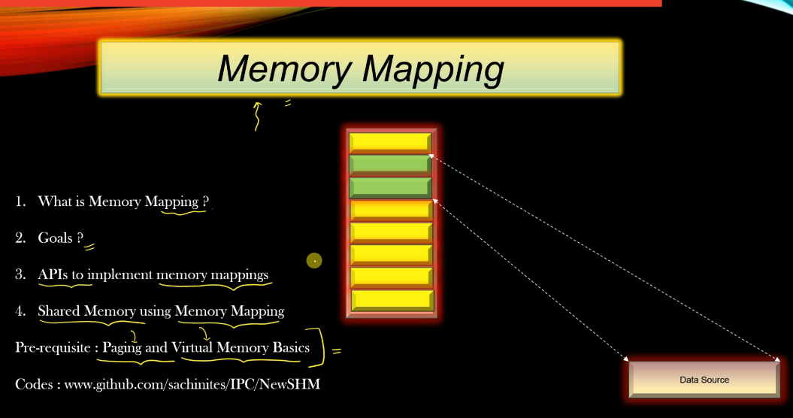

Memory Mapping
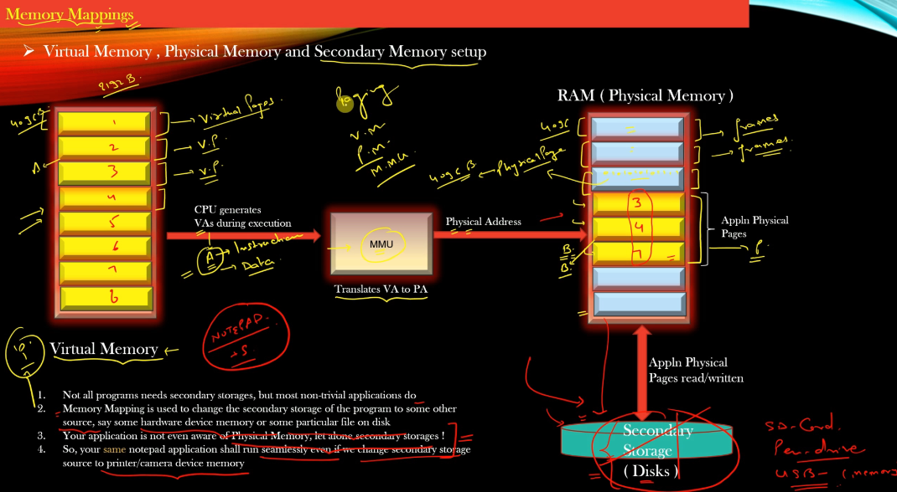

Virtual Memory for each Process (also in RAM)
each virtual page = 4096 bytes (can change to 8192 bytes)
VA: Virtual Address in Process

RAM(Physical Memory)
Physical Pages == Frames (size of Frames = size of Virtual Pages = 4096 bytes)
PA: Physical Address

MMU
translate VA to PA

Disk = Secondary Storage 

NOTE: We see that only 3 Physical Pages are in RAM, not all Virtual Pages. Not all Process is allocated into RAM, some memory is shared by many process

NOTE: Process does not know about whether memory is RAM or Disk

EX:
Our PC
Pen drive 32 GB
DISK 512GB
== TOtal Secondary Storage = 512 + 32 = 544 GB

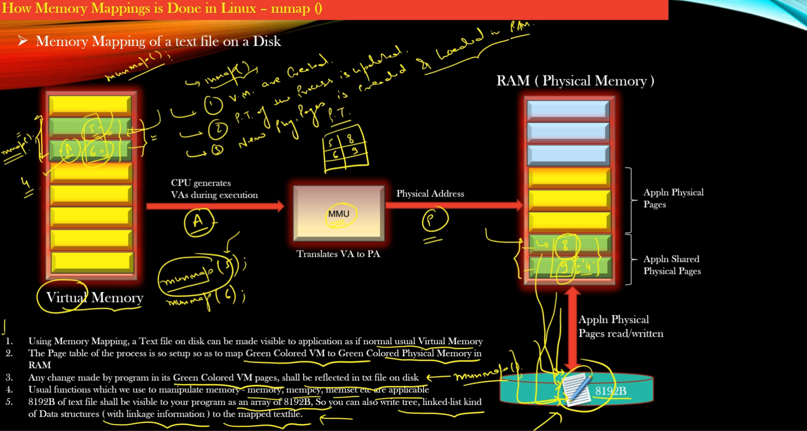
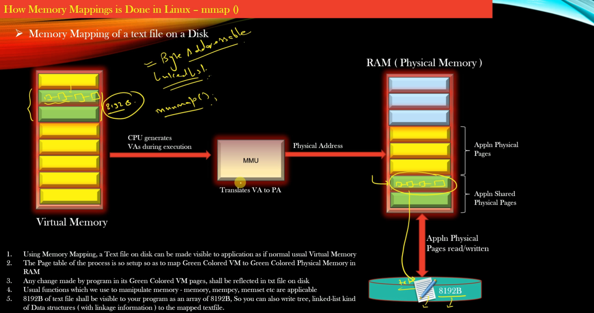

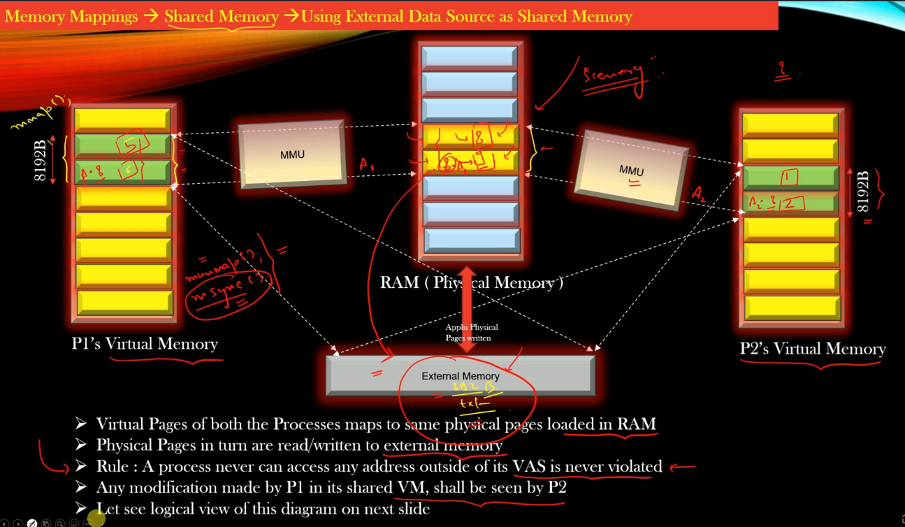
Note:
Memory in Page Unit, but mmap should continueous in both Virtual Memory But maybe in different frames of Physical Memory
In this example: 2 process import and use the same Physical Memory (import the same file)

unmmap() and msync() will sync the memory in Physical Ram to DISK. but unmmap() will also destroy the mapping

VAS: Virtual Address Space
Process can access the memory outside the VAS. If process to access outsite, process need to use mmap() or another way to similate it to add to process's VAS

RAM is middle man, because CPU access RAM 100x faster than Disk 
logical view is as below
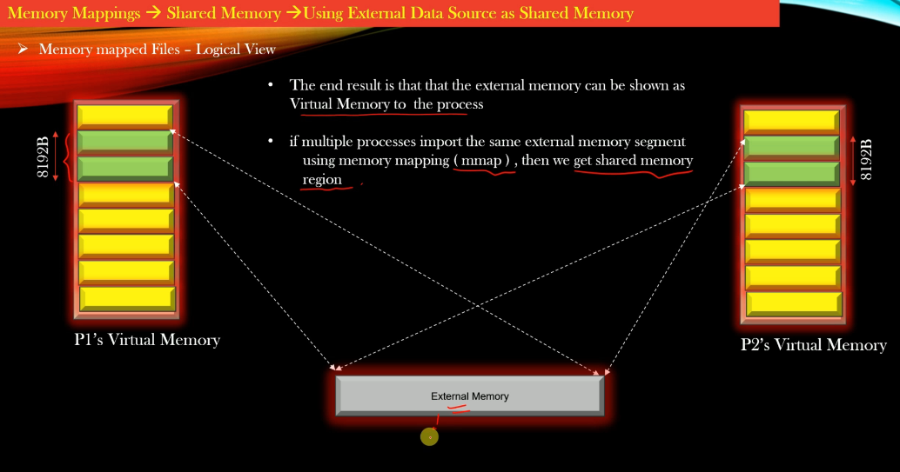

In term of IPC, no need to use  DISK ( or external memory source)
The variable changed by P1 will affect variable in P2 instantly 
==> no need to use msync()
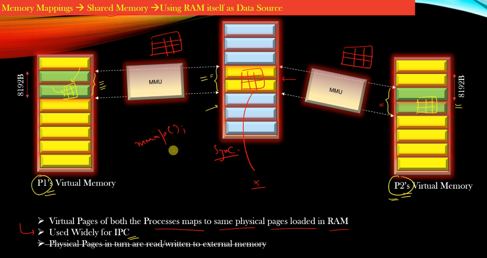

-----------------------------------------------------------

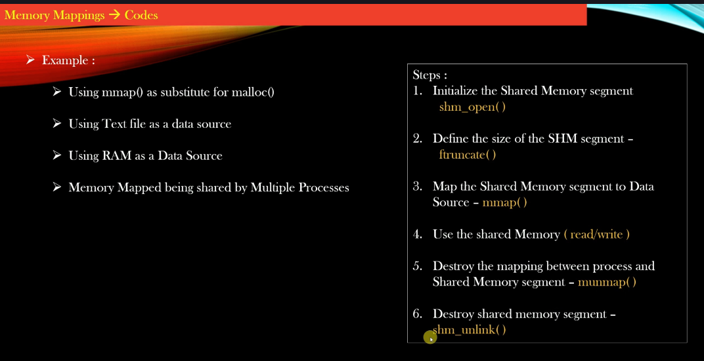

-----------------------------------------------------------
External Data Source as Shared Memory 

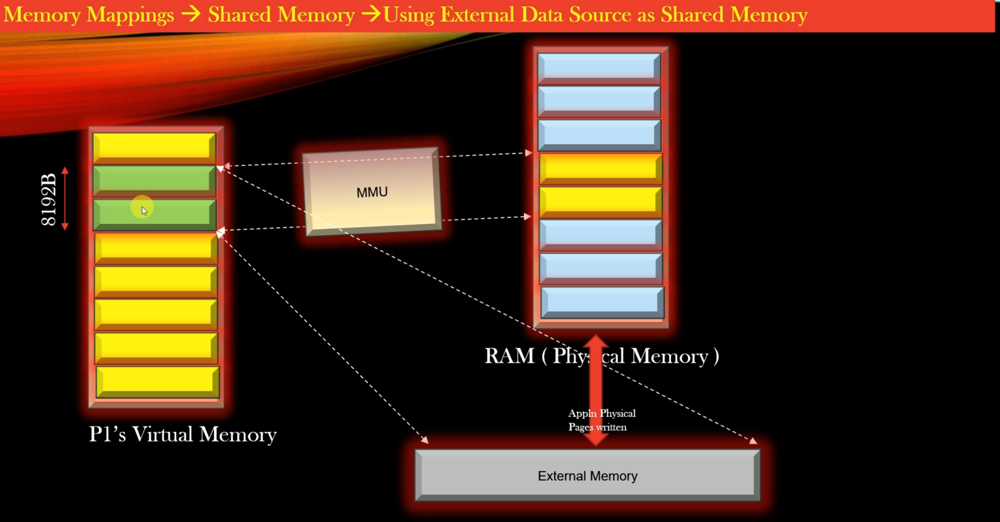

-----------------------------------------------------------
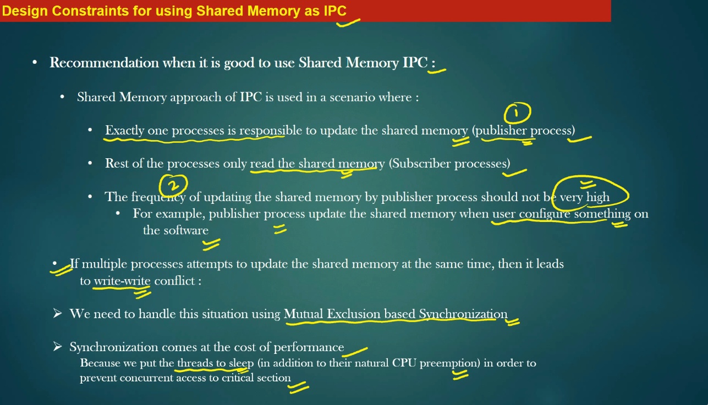
When use the Shared Memory

- 1 Publisher
- N Subscriber 
- frequency of updating is not very high 

Pitfall:
- Multiple processes write-write conflict 

- put the threads to sleep will reduce the performance of the software 

preemption: sự chiếm quyền

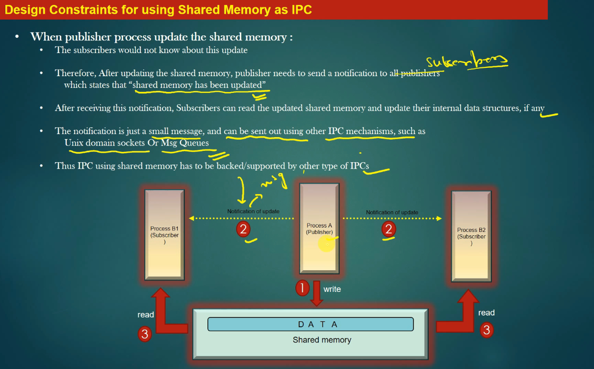
Publisher - Subscriber
- 1 Publisher: update memory
- Publisher will notify to all Subscriber
- All Subscriber will get the latest memory 

Notification is a small message, can be sent out using other IPC mechaniism such as Unix domain sockets or Msg QUeues

==> Thus, IPC using shared memory has to be backed/supported by other type of IPCs

